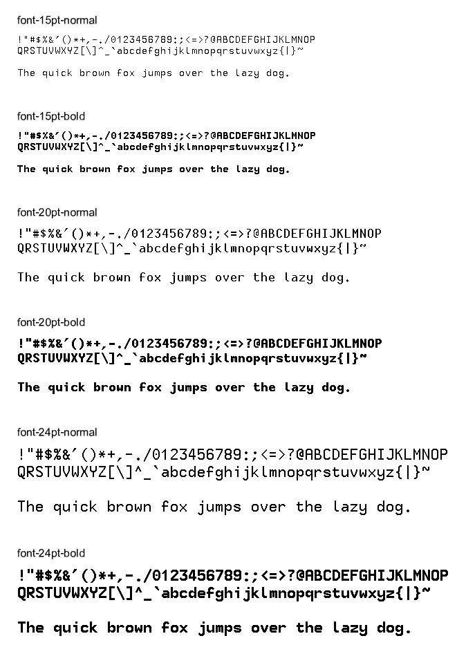
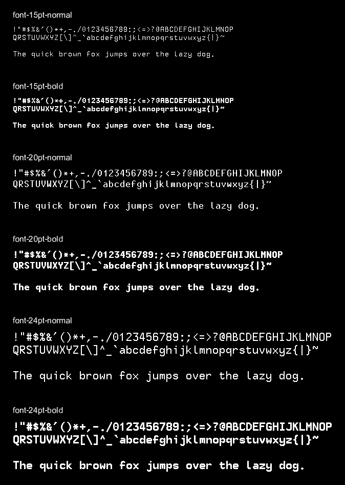

Fonts
=====

These fonts were sourced from [Jim's Fonts for X](https://github.com/nikolas/jmk-x11-fonts),
which is a collection of bitmap fonts in [BDF Format](https://en.wikipedia.org/wiki/Glyph_Bitmap_Distribution_Format).

Font Preview
------------

  
  

Generating Fonts
----------------

To generate the font in a format compatible with Firefly Scene,
use `node lib/font-gen/generate`.

Font Format
-----------

In Firefly Scene the data format is stored as an array of `uint16_t`.

The main segments are:

- header
  - (width << 8) | height
  - @TODO
- glyph pointers; an array of 94 entries
  - (height << 8) | top
  - offset into glyph data for scanline data
- glyph data
  - bitmap data left-to-right per scanline

License
-------

The fonts by Jim Knoble are licensed under the GPL License.

The generation script by Richard Moore is licensed under the MIT License.
